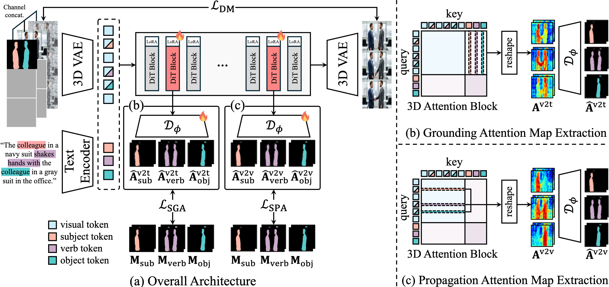

# MATRIX: Mask Track Alignment for Interaction-aware Video Generation
<a href="https://arxiv.org/pdf/2510.07310"></a>
<a href="https://cvlab-kaist.github.io/MATRIX"></a>  
<br>

This is the official implmentation of the paper *"MATRIX: Mask Track Alignment for Interaction-aware Video Generation"*

by [Siyoon Jin](https://JinSY515.github.io/my-page/), [Seongchan Kim](https://deep-overflow.github.io/), [Dahyun Chung](https://scholar.google.com/citations?user=EU52riMAAAAJ&hl=ko), [Jaeho Lee](https://scholar.google.com/citations?user=rfDpohEAAAAJ&hl=ko), [Hyunwook Choi](https://scholar.google.com/citations?user=vqSp0lwAAAAJ&hl=ko), [Jisu Nam](https://nam-jisu.github.io), [Jiyoung Kim](https://scholar.google.com/citations?user=DqG-ybIAAAAJ&hl=ko) and [Seungryong Kim](https://cvlab.kaist.ac.kr/members/faculty)

# Introduction 
<br>

### 🤔 How do Video Diffusion Transformers semantically bind text and video, and how is this binding propagated to support interactions? 

MATRIX identifies interaction-dominant layers in video DiTs and introduces a simple yet effective regularization that aligns their attention to multi-instance mask tracks, resulting in more interaction-aware video generation.

MATRIX introduces :

- 🔎  **Novel Analysis** specifically designed to quantify semantic grounding and propagation 

- 🚀 **Simple yet Effective Loss Design** that aligns the attention in interaction-dominant layers with multi-instance mask tracks 

- 🏅 **Novel InterGenEval Metrics** designed to evaluate interaction-awareness of the generated video.

# Installation 
```
git clone https://github.com/cvlab-kaist/MATRIX.git 
cd MATRIX

conda create -n matrix python=3.11 -y
conda activate matrix
pip install -r requirements.txt 

cd diffusers
pip install -e .
```

# Semantic Grounding & Propagation Analysis 
## Analysis on Generated Videos
For video DiT backbone models, including CogVideoX-2B-I2V, CogVideoX-5B-I2V, HunyuanVideo-I2V, Wan2.1-14B-I2V, we provide analysis framework. 
Additional details and settings are available in ``ATTN_ANALYSIS`` directory
```
bash analyze_attention.sh 
```
**Options**
- ``--model`` : video backbone model, choices = ['cogvideox_i2v_2b', 'cogvideox_i2v_5b', 'wan-i2v', 'hunyuan-i2v']
- ``--height`` : height of the generated video (e.g., 480, must be multiple of 16) 
- ``--width`` : width of the generated video (e.g., 720, must be multiple of 16)
- ``--text_len`` : length of the text embedding (e.g., 226 for CogVideoX)
- ``--num_frames`` : number of frames (e.g., 49)
- ``--output_dir`` : output directory to save generated videos 
- ``--data_dir`` : directory of RGB frames 
- ``--masks_dir`` : directory of mask frames 
- ``--prompt_path`` : path to prompt json file 

# MATRIX
 
Code and weights will be released soon! 

# InterGenEval

Refer to [InterGenEval](InterGenEval/README.md)

# Citation
If you find this research useful, please consider citing:
```
@misc{jin2025matrixmasktrackalignment,
      title={MATRIX: Mask Track Alignment for Interaction-aware Video Generation}, 
      author={Siyoon Jin and Seongchan Kim and Dahyun Chung and Jaeho Lee and Hyunwook Choi and Jisu Nam and Jiyoung Kim and Seungryong Kim},
      year={2025},
      eprint={2510.07310},
      archivePrefix={arXiv},
      primaryClass={cs.CV},
      url={https://arxiv.org/abs/2510.07310}, 
}
```